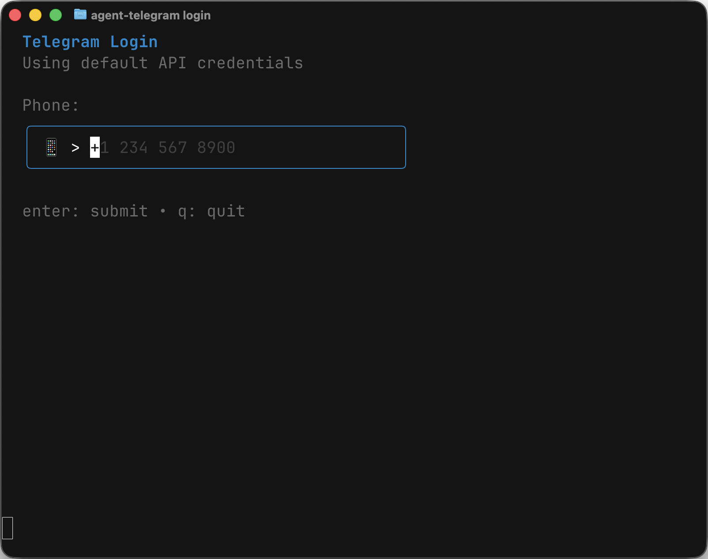

# agent-telegram

Telegram automation CLI for AI agents. Fast Go binary with MTProto API.

By Aslan Dukaev [X](https://x.com/dukaev) ·[Telegram](https://t.me/dukaev)



## Installation

### Package Managers

```bash
bun add -g agent-telegram
npm install -g agent-telegram
```

### From Source

```bash
git clone https://github.com/dukaev/agent-telegram
cd agent-telegram
go build -o agent-telegram .
```

## Quick Start

```bash
agent-telegram login                      # Interactive login
agent-telegram my-info                    # Get your profile
agent-telegram chat list                  # List all chats
agent-telegram chat open @username        # View messages from chat
agent-telegram send @user "Hello!"        # Send message
agent-telegram stop                       # Stop server
```

## Commands

### Authentication

```bash
agent-telegram login                      # Interactive login
agent-telegram logout                     # Logout and clear session
agent-telegram my-info                    # Get your profile information
agent-telegram llms-txt                   # Generate full CLI documentation for LLMs
```

### Send Messages

Supports both subcommands and flags for backward compatibility:

```bash
# Subcommands (recommended)
agent-telegram send text @user "Hello!"                    # Text message
agent-telegram send photo @user image.png                  # Photo
agent-telegram send photo @user image.png --caption "Nice" # Photo with caption
agent-telegram send video @user video.mp4                  # Video
agent-telegram send voice @user voice.ogg                  # Voice message
agent-telegram send sticker @user file.webp                # Sticker
agent-telegram send dice @user                             # Dice (random value)
agent-telegram send dice @user --emoticon 🎯               # Dice with emoticon
agent-telegram send poll @user "Question?" --option A --option B  # Poll
agent-telegram send location @user --lat 55.75 --long 37.61      # Location
agent-telegram send contact @user --phone "+123" --first-name Jo  # Contact

# Flag syntax (still works)
agent-telegram send --to @user "text"
agent-telegram send --to @user --photo image.png
agent-telegram send --to @user --video video.mp4
agent-telegram send --to @user --voice voice.ogg
agent-telegram send --to @user --video-note vid.mp4
agent-telegram send --to @user --sticker file.webp
agent-telegram send --to @user --gif anim.mp4
agent-telegram send --to @user --document file.pdf
agent-telegram send --to @user --audio music.mp3
agent-telegram send --to @user --dice
agent-telegram send --to @user --contact "+1234567890" --first-name "John"
agent-telegram send --to @user --reply-to 123 "Reply text"
agent-telegram send --to @user --poll "Question?" --option "Yes" --option "No"
agent-telegram send --to @user --latitude 55.7558 --longitude 37.6173

# Pipe support
echo "Hello from pipe" | agent-telegram send @user
```

### Message Management (`msg`)

```bash
agent-telegram msg list @user              # List messages
agent-telegram msg list @user --output ids # List message IDs only (pipe-friendly)
agent-telegram msg read --to @user         # Mark messages as read
agent-telegram msg typing --to @user       # Send typing indicator
agent-telegram msg scheduled --to @user    # List scheduled messages
agent-telegram msg delete --to @user 123   # Delete message by ID
agent-telegram msg delete --to @user 1,2,3 # Delete multiple messages
agent-telegram msg forward 123 --from @user --to @other  # Forward message
agent-telegram msg pin 123 --to @user      # Pin message
agent-telegram msg pin 123 --to @user --unpin            # Unpin message
agent-telegram msg reaction 123 "👍" --to @user          # Add reaction
agent-telegram msg inspect-buttons 123 --to @user        # View inline buttons
agent-telegram msg press-button 123 0 --to @user         # Press button
agent-telegram msg inspect-keyboard --to @user           # View reply keyboard
agent-telegram msg clear --to @user 123,456              # Clear specific messages
agent-telegram msg clear --to @user --history             # Clear entire history
agent-telegram msg clear --to @user --history --revoke    # Clear history for both sides
```

### Chat Management (`chat`)

```bash
agent-telegram chat list                  # List all chats
agent-telegram chat list -l 50            # List with limit
agent-telegram chat info --to @channel    # Get chat information
agent-telegram chat open @user            # View messages
agent-telegram chat open @user -l 50      # View 50 messages
agent-telegram chat open @user -l 50 -o 100   # With offset
agent-telegram chat create-group "Name" --members @user1,@user2  # Create group
agent-telegram chat create-channel "Name" --description "Desc"   # Create channel
agent-telegram chat join --link https://t.me/+invite             # Join via link
agent-telegram chat subscribe --channel @channel                 # Subscribe to channel
agent-telegram chat leave --to @group     # Leave chat/channel
agent-telegram chat invite --to @group --user @user              # Invite user
agent-telegram chat edit-title --to @group --title "New Title"   # Edit title
agent-telegram chat set-photo --to @group --file photo.jpg       # Set photo
agent-telegram chat delete-photo --to @group                     # Delete photo
agent-telegram chat pin --to @group       # Pin chat in list
agent-telegram chat mute --to @group      # Mute notifications
agent-telegram chat archive --to @group   # Archive chat
agent-telegram chat topics --to @forum    # List forum topics
agent-telegram chat invite-link --to @group  # Get/create invite link
```

### Members & Admins

```bash
agent-telegram chat participants --to @group   # List members
agent-telegram chat admins --to @group         # List admins
agent-telegram chat banned --to @group         # List banned users
agent-telegram chat promote-admin --to @group --user @user    # Promote to admin
agent-telegram chat demote-admin --to @group --user @user     # Demote admin
agent-telegram chat slow-mode --to @group --seconds 30        # Set slow mode
agent-telegram chat permissions --to @group --send-messages    # Set permissions
```

### Contacts (`contact`)

```bash
agent-telegram contact list               # List contacts
agent-telegram contact add --phone "+1234567890" --first-name "John" --last-name "Doe"
agent-telegram contact delete --user @user
```

### User (`user`)

```bash
agent-telegram user info @user            # Get user info
agent-telegram user ban --to @user        # Block user
agent-telegram user ban --to @user -d     # Unblock user
```

### Folders (`folders`)

```bash
agent-telegram folders list               # List chat folders
agent-telegram folders create --title "Work" --include-groups  # Create folder
agent-telegram folders delete --id 1      # Delete folder by ID
```

### Privacy (`privacy`)

```bash
agent-telegram privacy get --key phone_number    # Get privacy setting
agent-telegram privacy set --key phone_number --rule allow_contacts  # Set privacy
```

**Privacy keys:** `status_timestamp`, `phone_number`, `profile_photo`, `forwards`, `phone_call`, `voice_messages`, `about`

**Rules:** `allow_all`, `allow_contacts`, `disallow_all`, `allow_close_friends`

### Search

```bash
agent-telegram search global "query"                # Global search
agent-telegram search global "query" --type bots    # Search bots only
agent-telegram search in-chat "query" --to @user    # Search in specific chat
agent-telegram search in-chat "query" --to @user --type photos  # Search photos
```

### Updates

```bash
agent-telegram updates                    # Get pending updates
agent-telegram updates -l 50             # Get 50 updates
agent-telegram updates --follow           # Continuous polling (JSON Lines)
agent-telegram updates --follow --type new_message   # Filter by type
agent-telegram updates --follow --interval 5         # Poll every 5 seconds
agent-telegram updates --follow | jq '.type'         # Pipe to jq
```

### Server

```bash
agent-telegram serve                      # Start IPC server (background)
agent-telegram status                     # Check server status
agent-telegram stop                       # Stop server
```

### Other

```bash
agent-telegram open @user                 # Quick open chat (alias)
```

## Global Options

| Option | Description |
|--------|-------------|
| `-s, --socket <path>` | Path to Unix socket (default: `/tmp/agent-telegram.sock`) |
| `-q, --quiet` | Suppress status messages (data still goes to stdout) |
| `-T, --text` | Output human-readable text instead of JSON |
| `--output <format>` | Output format: `text`, `json`, `ids` |
| `--fields <list>` | Select output fields (comma-separated) |
| `--filter <expr>` | Filter results (e.g., `type=channel`, `stars>1000`) |
| `--dry-run` | Preview action without executing |
| `-l, --limit <n>` | Limit results (per command) |
| `-o, --offset <n>` | Offset for pagination (per command) |

## Environment Variables

| Variable | Description |
|----------|-------------|
| `TELEGRAM_APP_ID` | Telegram API App ID (optional, has default) |
| `TELEGRAM_APP_HASH` | Telegram API App Hash (optional, has default) |
| `TELEGRAM_PHONE` | Phone number for auth (optional) |
| `AGENT_TELEGRAM_SESSION_PATH` | Custom session file path |

Default API credentials are built-in, so you can start using agent-telegram immediately. To use your own credentials, get them at https://my.telegram.org and set via environment variables or `.env` file.

## Pipe-Friendly Patterns

All commands output JSON to stdout by default. Status/logs go to stderr.

```bash
# Get message IDs for piping
agent-telegram msg list @user --output ids | head -5

# Filter and select fields
agent-telegram chat list --fields peer,title,type --filter type=channel

# Continuous monitoring with jq
agent-telegram updates --follow --type new_message | jq '{from: .data.message.from_name, text: .data.message.text}'

# Quiet mode (suppress stderr, data only)
agent-telegram msg list @user -q | jq '.messages[].text'

# Compose commands
agent-telegram search global "bot" --output ids | head -3
```

## Usage with AI Agents

### Just ask the agent

The simplest approach - just tell your agent to use it:

```
Use agent-telegram to send a message to @username. Run agent-telegram --help to see available commands.
```

```markdown
## Telegram Automation

Use `agent-telegram` for Telegram automation. Run `agent-telegram --help` for all commands.

Core workflow:
1. `agent-telegram serve` - Start background server
2. `agent-telegram status` - Verify connection
3. `agent-telegram chat list` - List available chats
4. `agent-telegram msg list @user` - Read messages
5. `agent-telegram send @user "message"` - Send message
6. `agent-telegram updates --follow` - Monitor for new messages
```

## IPC Protocol (JSON-RPC)

All commands communicate via JSON-RPC over Unix socket at `/tmp/agent-telegram.sock`:

```bash
# Direct IPC call
echo '{"method":"send_message","params":{"peer":"@user","message":"Hi"}}' | nc -U /tmp/agent-telegram.sock
```

### Available Methods (77+)

**Messages:** `send_message`, `send_reply`, `update_message`, `delete_message`, `forward_message`, `get_messages`, `clear_messages`, `clear_history`, `read_messages`, `set_typing`, `get_scheduled_messages`

**Media:** `send_photo`, `send_video`, `send_file`, `send_voice`, `send_video_note`, `send_sticker`, `send_gif`, `send_location`, `send_contact`, `send_poll`, `send_dice`

**Reactions:** `add_reaction`, `remove_reaction`, `list_reactions`

**Buttons:** `inspect_inline_buttons`, `press_inline_button`, `inspect_reply_keyboard`

**Pins:** `pin_message`, `unpin_message`, `pin_chat`

**Chats:** `get_chats`, `get_topics`, `create_group`, `create_channel`, `edit_title`, `set_photo`, `delete_photo`, `leave`, `invite`, `join_chat`, `subscribe_channel`, `get_invite_link`

**Members:** `get_participants`, `get_admins`, `get_banned`, `promote_admin`, `demote_admin`

**Settings:** `set_slow_mode`, `set_chat_permissions`

**Folders:** `get_folders`, `create_folder`, `delete_folder`

**Users:** `get_me`, `get_user_info`, `update_profile`, `update_avatar`, `block`, `unblock`

**Contacts:** `get_contacts`, `add_contact`, `delete_contact`

**Privacy:** `get_privacy`, `set_privacy`

**Search:** `search_global`, `search_in_chat`

**Updates:** `get_updates`

**System:** `status`, `shutdown`, `ping`

## Architecture

agent-telegram uses a client-daemon architecture:

```
┌─────────────┐      IPC       ┌──────────────┐      MTProto
│ CLI Command │ ─────────────> │ IPC Server   │ ──────────────> Telegram
│ (Go binary) │  Unix Socket   │ (background) │   (gotd/td)
└─────────────┘                └──────────────┘
```

- **CLI Commands** - Parse arguments, communicate with daemon via IPC
- **IPC Server** - Background daemon managing Telegram connection
- **Telegram Client** - MTProto client using [gotd/td](https://github.com/gotd/td) library

The daemon starts automatically on first command and persists between commands for fast subsequent operations.

### File Locations

| File | Path |
|------|------|
| Unix socket | `/tmp/agent-telegram.sock` |
| Session | `~/.agent-telegram/session.json` |
| Logs | `~/.agent-telegram/server.log` |
| PID file | `~/.agent-telegram/server.pid` |
| Lock file | `~/.agent-telegram/server.lock` |

## Sessions

Each session maintains its own:
- Telegram connection
- Authentication state
- Message history cache
- Update store

Use `--socket` to run multiple isolated instances:

```bash
# Different sessions
agent-telegram --socket /tmp/agent1.sock serve
agent-telegram --socket /tmp/agent2.sock serve

# Use specific session
agent-telegram --socket /tmp/agent1.sock chat list
```

## Development

See [DEVELOPMENT.md](DEVELOPMENT.md) for:
- Architecture overview
- Adding new commands
- Common patterns
- Project structure

## License

MIT
